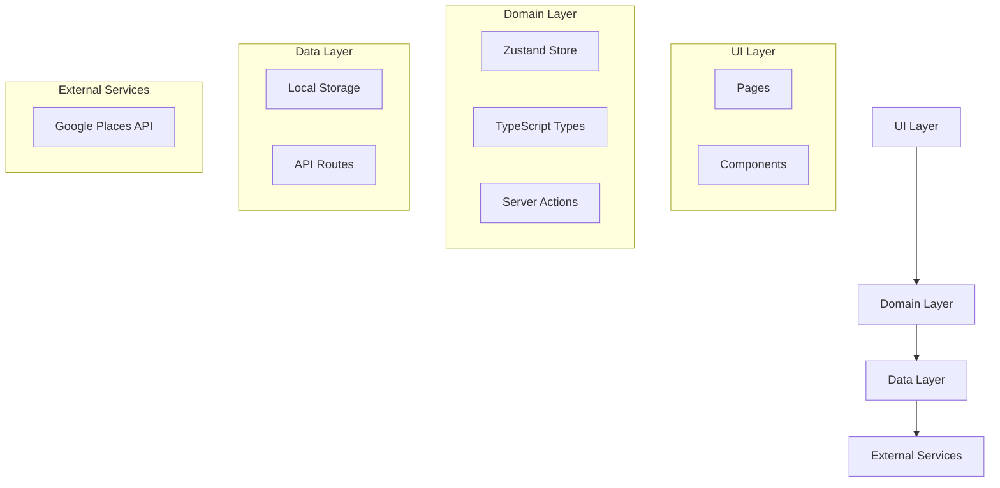
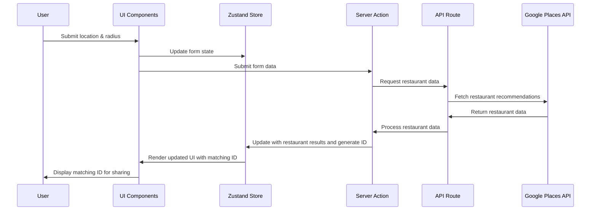
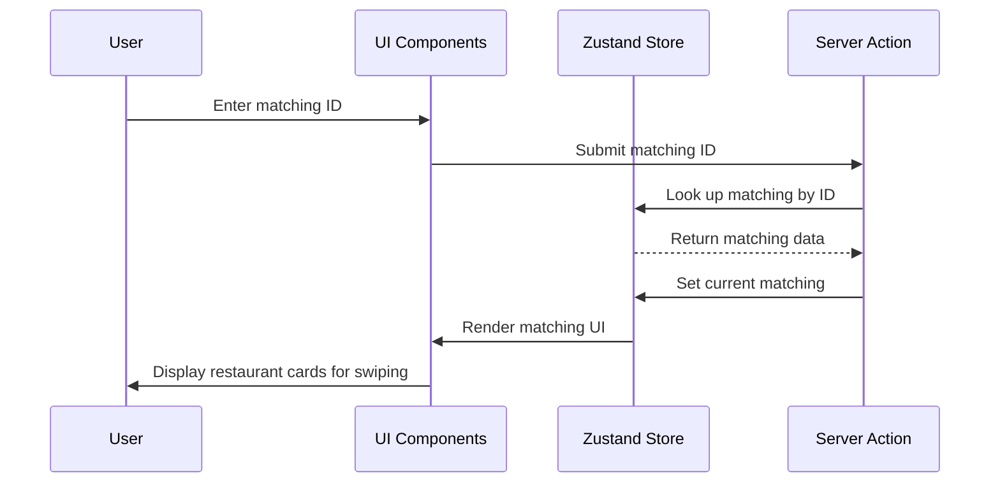
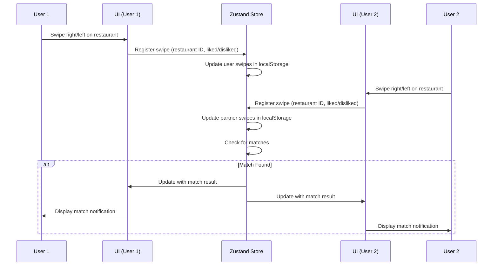
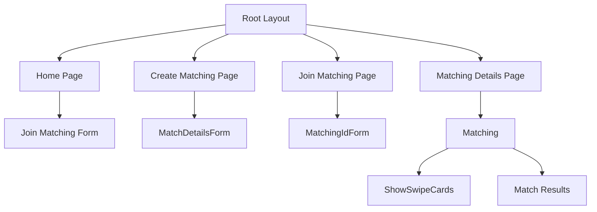

# System Patterns: Restaurant Matcher

## Architecture Overview

The Restaurant Matcher application follows a clean architecture pattern with clear separation of concerns. The architecture is organized into the following layers:



## Design Patterns

### 1. Repository Pattern
- Used for data access abstraction through the `fetchRestaurants.ts` utility
- Isolates the data layer from the business logic
- Provides a clean API for accessing external data sources

### 2. Store Pattern (with Zustand)
- Centralizes application state management
- Provides a predictable state container
- Enables persistence through localStorage integration

### 3. Component Composition
- UI is composed of smaller, reusable components
- Clear separation between container and presentational components
- Props as the primary means of component communication

### 4. Server Actions
- Leverages Next.js server actions for server-side operations
- Clear separation between client and server functionality
- Typed API for enhanced type safety

## Data Flow

### Create Matching Flow


### Join Matching Flow


### Swiping and Matching Flow


## Component Structure



## State Management

The application uses Zustand for state management with the following structure:

```typescript
interface MatchingStore {
  // Matching data
  matchings: Record<string, Matching>; // matchingId: Matching
  currentMatchingId: string | null;
  
  // User data
  userId: string;
  userRole: 'initiator' | 'joiner' | null;
  
  // Swipe data
  userSwipes: Record<string, boolean>; // restaurantId: liked
  partnerSwipes: Record<string, boolean>; // restaurantId: liked
  matches: string[]; // Array of matching restaurant IDs
  
  // Actions
  createMatching: (location: [number, number], radius: number) => Promise<string>;
  joinMatching: (matchingId: string) => Promise<boolean>;
  setCurrentMatching: (id: string) => void;
  addRestaurantsToMatching: (id: string, restaurants: Restaurant[]) => void;
  registerSwipe: (restaurantId: string, liked: boolean) => void;
  updatePartnerSwipes: (swipes: Record<string, boolean>) => void;
  checkForMatches: () => string[];
  
  // Persistence
  persist: {
    getState: () => MatchingStore;
    setState: (state: MatchingStore) => void;
  }
}
```

## Folder Structure Patterns

- **/app**: Next.js App Router pages and API routes
- **/components**: Reusable UI components
- **/utils**: Utility functions
- **/lib**: Core functionality (actions, store, types)
- **/public**: Static assets

## API Integration Pattern

The application follows a clean API integration pattern:

1. **Client request** initiated from UI component
2. **Server action** processes the request
3. **API route** handles external service communication
4. **Data transformation** converts external data to application format
5. **State update** with processed data
6. **UI update** to reflect new data

## Performance Patterns

- Server-side rendering for initial page load
- Client-side state updates for interactive elements
- Optimistic UI updates where appropriate
- Lazy loading for non-critical resources

## Real-time Synchronization Pattern

The application implements a simplified real-time synchronization pattern for matching:

1. **Local State First**: All user actions are immediately reflected in local state
2. **Persistent Storage**: All state changes are persisted to localStorage
3. **Polling Strategy**: UI periodically checks for updates to partner swipes
4. **Match Detection**: When both users have swiped on the same restaurants, matches are calculated
5. **UI Updates**: Match results are propagated to both users' interfaces

This approach provides a lightweight alternative to WebSockets or Server-Sent Events for this specific use case where absolute real-time updates aren't critical.
